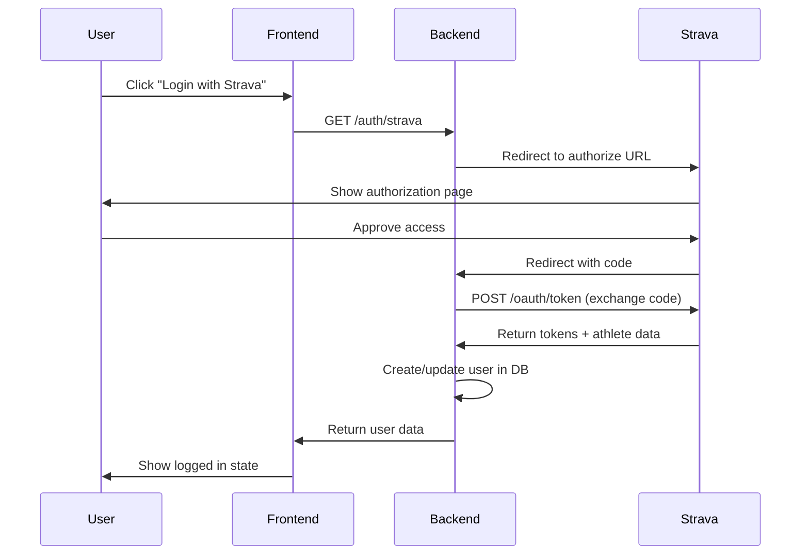
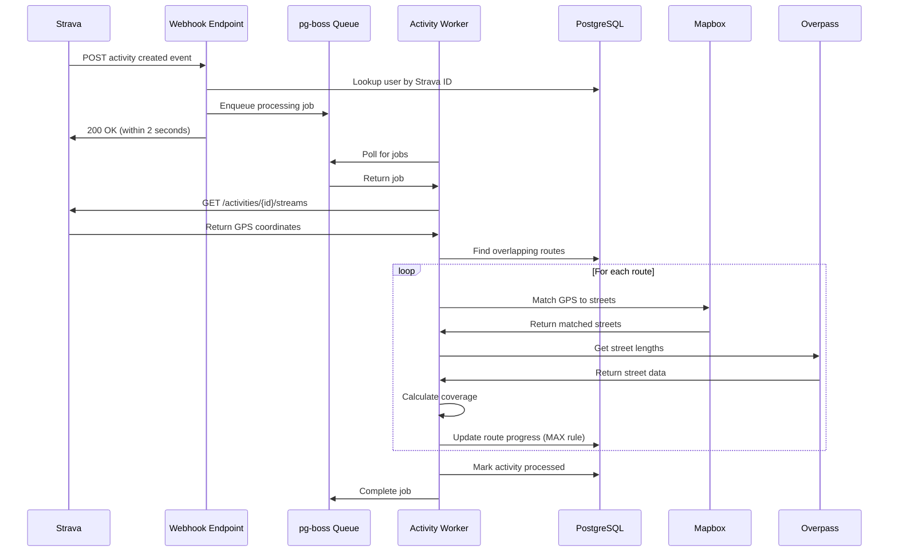
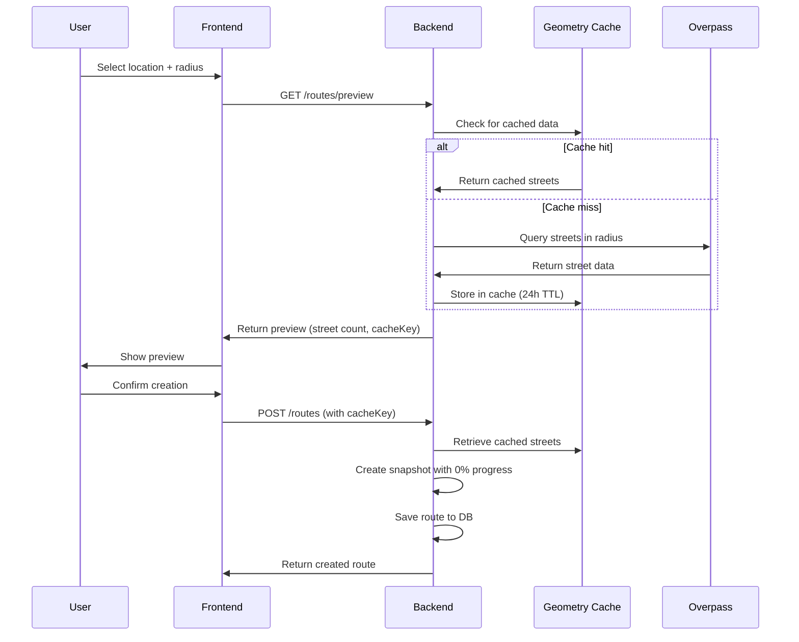
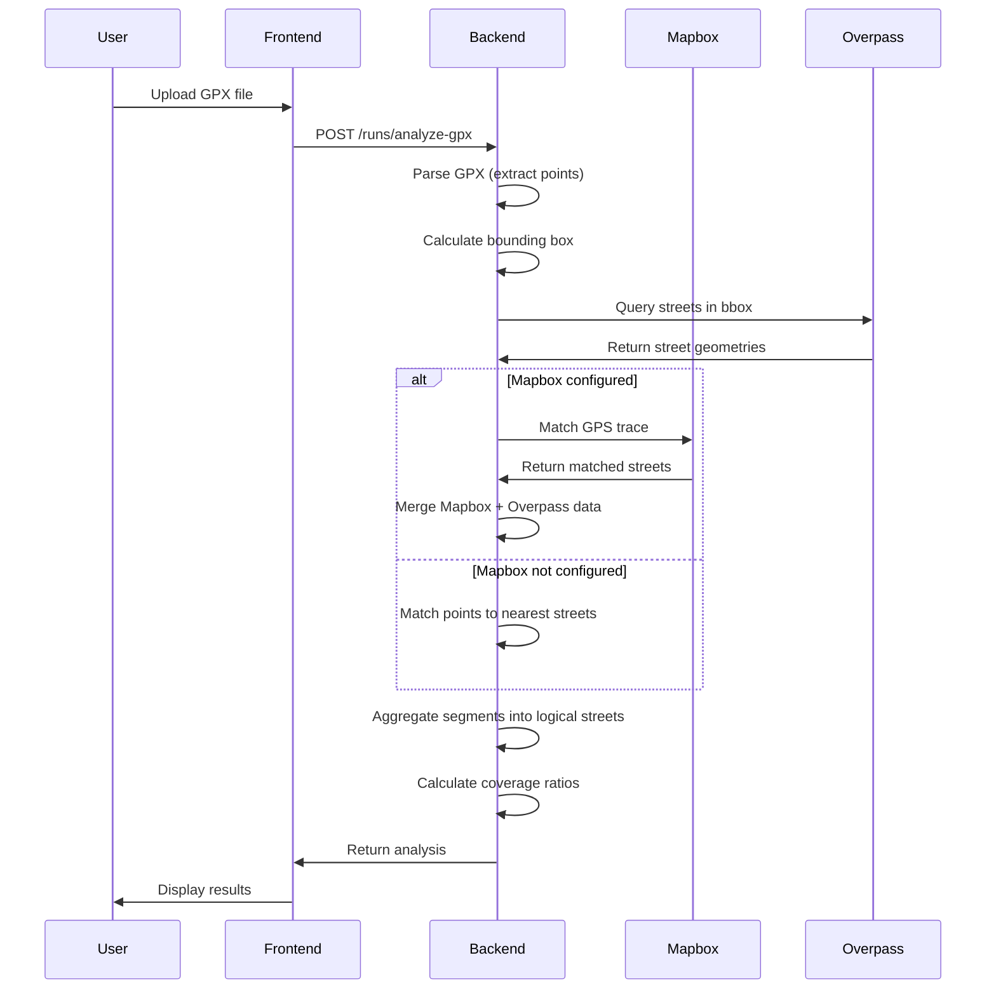

# Street Keeper Architecture

This document explains the system architecture, design decisions, and data flows in the Street Keeper backend.

## Table of Contents

1. [System Overview](#system-overview)
2. [Three-Layer Architecture](#three-layer-architecture)
3. [External Service Integrations](#external-service-integrations)
4. [Design Decisions](#design-decisions)
5. [Data Flow Diagrams](#data-flow-diagrams)
6. [Database Schema](#database-schema)

---

## System Overview

Street Keeper is a fitness tracking API that processes GPS data from Strava to track street coverage for runners. The system allows users to:

1. **Create Routes** - Define geographic areas (circles) to track
2. **Sync Activities** - Automatically receive activities from Strava via webhooks
3. **Track Progress** - See which streets they've run and their completion percentage
4. **View Map** - See streets they've run with geometry and stats (completed/partial, run counts)
5. **Analyze GPX** - Upload GPX files for standalone street analysis

```
┌─────────────────────────────────────────────────────────────────────────────┐
│                              STREET KEEPER                                   │
├─────────────────────────────────────────────────────────────────────────────┤
│                                                                              │
│   ┌──────────┐     ┌──────────┐     ┌──────────┐     ┌──────────┐          │
│   │  Strava  │     │  Client  │     │  Mapbox  │     │ Overpass │          │
│   │   API    │     │   App    │     │   API    │     │   API    │          │
│   └────┬─────┘     └────┬─────┘     └────┬─────┘     └────┬─────┘          │
│        │                │                │                │                 │
│        ▼                ▼                ▼                ▼                 │
│   ┌────────────────────────────────────────────────────────────┐           │
│   │                     Express Server                          │           │
│   │  ┌─────────┐  ┌─────────┐  ┌─────────┐  ┌─────────┐  ┌─────────┐    │           │
│   │  │  Auth   │  │ Routes  │  │Activity │  │   Map   │  │  GPX    │    │           │
│   │  │ Routes  │  │ Routes  │  │ Routes  │  │ Routes  │  │ Routes  │    │           │
│   │  └────┬────┘  └────┬────┘  └────┬────┘  └────┬────┘  └────┬────┘    │           │
│   │       │            │            │            │            │          │           │
│   │       ▼            ▼            ▼            ▼            ▼          │           │
│   │  ┌──────────────────────────────────────────────────────────────┐   │           │
│   │  │                      Services Layer                            │   │           │
│   │  │  auth | route | activity | map | user-street-progress | ...  │   │           │
│   │  └───────────────────────┬─────────────────────────┘       │           │
│   └──────────────────────────┼──────────────────────────────────┘           │
│                              │                                              │
│   ┌──────────────────────────┼──────────────────────────────────┐           │
│   │                          ▼                                   │           │
│   │  ┌─────────────┐    ┌─────────────┐    ┌─────────────┐     │           │
│   │  │   Prisma    │    │   pg-boss   │    │  Geometry   │     │           │
│   │  │   Client    │    │    Queue    │    │    Cache    │     │           │
│   │  └──────┬──────┘    └──────┬──────┘    └──────┬──────┘     │           │
│   │         │                  │                  │             │           │
│   │         └──────────────────┼──────────────────┘             │           │
│   │                            ▼                                 │           │
│   │                    ┌──────────────┐                         │           │
│   │                    │  PostgreSQL  │                         │           │
│   │                    └──────────────┘                         │           │
│   └──────────────────────────────────────────────────────────────┘           │
│                                                                              │
└─────────────────────────────────────────────────────────────────────────────┘
```

---

## Three-Layer Architecture

The codebase follows a strict three-layer architecture:

### Routes Layer (Thin Controllers)

- HTTP endpoint definitions
- Request parsing and validation
- Response formatting
- **Delegates business logic to services**

### Services Layer (Business Logic)

- Core application logic
- External API calls (Strava, Mapbox, Overpass)
- Database operations via Prisma
- Data transformation

### Data Layer (Prisma)

- Database models and queries
- Transaction management
- Generated client from schema

```
┌─────────────────────────────────────────────────────────────────┐
│                       Routes Layer                               │
│  - HTTP endpoint definitions                                     │
│  - Request parsing & validation                                  │
│  - Response formatting                                           │
│  - Delegates to services                                         │
└─────────────────────────────────────────────────────────────────┘
                              │
                              ▼
┌─────────────────────────────────────────────────────────────────┐
│                      Services Layer                              │
│  - Business logic                                                │
│  - External API calls (Strava, Mapbox, Overpass)                │
│  - Database operations via Prisma                                │
│  - Data transformation                                           │
└─────────────────────────────────────────────────────────────────┘
                              │
                              ▼
┌─────────────────────────────────────────────────────────────────┐
│                       Data Layer                                 │
│  - Prisma Client (ORM)                                          │
│  - Database models                                               │
└─────────────────────────────────────────────────────────────────┘
```

**Layer Responsibilities:**

| Layer         | Can Call                              | Cannot Call       |
| ------------- | ------------------------------------- | ----------------- |
| Routes        | Services                              | Database directly |
| Services      | Other services, Prisma, External APIs | Routes            |
| Data (Prisma) | Database                              | Services, Routes  |

---

## External Service Integrations

### Strava API

- **Purpose:** User authentication (OAuth) and activity data
- **Used for:** Login, activity streams (GPS coordinates), webhooks
- **Rate limits:** 100 requests/15 min, 1000 requests/day

### Mapbox Map Matching API

- **Purpose:** High-accuracy GPS trace matching
- **Used for:** Snapping GPS points to road network (~98% accuracy)
- **Fallback:** Overpass-only matching (~85% accuracy)
- **Rate limits:** 100,000 requests/month (free tier)

### Overpass API (OpenStreetMap)

- **Purpose:** Street geometry and metadata
- **Used for:** Querying streets in an area, street names and lengths
- **Fallback servers:** Multiple servers for reliability
- **Rate limits:** Best effort, with retries

---

## Design Decisions

### 1. PostgreSQL over MongoDB

**Decision:** Use PostgreSQL as the primary database.

**Rationale:**

- **Relational data model:** Routes → Activities → Streets have clear relationships
- **JSON support:** PostgreSQL's JSONB handles street snapshots efficiently
- **Prisma maturity:** Prisma ORM has excellent PostgreSQL support
- **ACID compliance:** Important for progress calculations
- **pg-boss compatibility:** Job queue uses same database

**Trade-offs:**

- Less flexible schema than MongoDB
- Requires migrations for schema changes

---

### 2. pg-boss over Redis/BullMQ

**Decision:** Use pg-boss (PostgreSQL-based) for job queuing instead of Redis/BullMQ.

**Rationale:**

- **Single database:** No additional infrastructure (Redis) to manage
- **Simpler deployment:** One connection string, one database
- **Transactional consistency:** Jobs and data in same transaction
- **Good enough performance:** Activity processing isn't high-throughput

**Trade-offs:**

- Slightly slower than Redis for very high volumes
- Less ecosystem than BullMQ

---

### 3. Hybrid Mapbox + Overpass for Street Matching

**Decision:** Use Mapbox for GPS matching, Overpass for street lengths.

**Rationale:**

- **Mapbox accuracy:** ~98% accuracy via routing algorithms
- **Overpass completeness:** Provides total street lengths for coverage %
- **Cost optimization:** Mapbox free tier is generous; Overpass is free
- **Graceful fallback:** Works without Mapbox (just lower accuracy)

**Trade-offs:**

- Two API calls per GPX analysis
- Complexity in merging results

---

### 4. JSON Snapshots in Route Table

**Decision:** Store street progress as JSON in the Route table, not separate tables.

**Rationale:**

- **Atomic updates:** Update all streets in one database operation
- **No join overhead:** Single query gets route + all streets
- **Simpler schema:** No Street, RouteStreet junction tables
- **Good performance:** PostgreSQL JSONB is fast for this size

**Trade-offs:**

- Can't query individual streets across routes
- Larger row sizes

---

### 5. 90% Threshold for Street Completion

**Decision:** A street is "completed" when 90% of its length is covered.

**Rationale:**

- **GPS drift tolerance:** GPS accuracy is ~5-10m, causing edge issues
- **Practical completion:** Most of the street was covered
- **User satisfaction:** 100% threshold would be frustrating

**Trade-offs:**

- Some uncovered sections count as "complete"
- Configurable via `STREET_MATCHING.COMPLETION_THRESHOLD`

**Map display (two-tier):** The map uses a second, stricter tier for **aggregated** streets (grouped by name). Street-level status is **completed** only when length-weighted completion ≥ 95% (`STREET_AGGREGATION.STREET_COMPLETION_THRESHOLD`). Short segments (≤ 20 m, "connectors") count at 50% weight so one small gap doesn’t mark the whole street partial. Segment-level polylines inherit their status from the aggregated street, so all segments of a street are drawn with the same style (solid green or dotted yellow). See [MAP_FEATURE.md](MAP_FEATURE.md#completion-status-two-tier-logic).

---

### 6. MAX Rule for Progress

**Decision:** Street progress can only increase, never decrease.

**Rationale:**

- **Better UX:** Users don't lose progress from re-running streets
- **Intuitive behavior:** "I ran more of that street" always helps
- **Handles GPS variance:** Different runs may match differently

**Trade-offs:**

- Can't "undo" a bad GPS match
- Deleting activities requires recalculation

---

### 7. Radius-Based Routes (Not Polygons)

**Decision:** Routes are circular areas defined by center point + radius.

**Rationale:**

- **Simpler MVP:** Easier to implement and understand
- **Clear boundaries:** Users know exactly what's included
- **Efficient queries:** Circle math is fast
- **Preset options:** 500m, 1km, 2km, 5km, 10km covers most use cases

**Trade-offs:**

- Can't define arbitrary shapes
- May include unwanted areas (water, parks)

---

### 8. 24-Hour Cache TTL for Geometry

**Decision:** Cache Overpass street data for 24 hours.

**Rationale:**

- **Street data is static:** Roads rarely change day-to-day
- **API rate limits:** Reduces Overpass load
- **User experience:** Faster route creation after preview
- **Cache efficiency:** Larger radius caches serve smaller requests

**Trade-offs:**

- New streets take 24h to appear
- Cache storage in database

---

## Data Flow Diagrams

### Strava OAuth Flow



### Activity Processing Pipeline



### Route Creation Flow



### GPX Analysis Flow



---

## Database Schema

### Entity Relationship Diagram

```
┌─────────────────┐       ┌─────────────────┐       ┌─────────────────┐
│      User       │       │      Route      │       │    Activity     │
├─────────────────┤       ├─────────────────┤       ├─────────────────┤
│ id (PK)         │──┐    │ id (PK)         │──┐    │ id (PK)         │
│ stravaId        │  │    │ userId (FK)     │◄─┘    │ userId (FK)     │◄─┐
│ name            │  │    │ name            │       │ stravaId        │  │
│ email           │  │    │ centerLat       │       │ name            │  │
│ profilePic      │  │    │ centerLng       │       │ distanceMeters  │  │
│ stravaTokens    │  │    │ radiusMeters    │       │ coordinates     │  │
│ createdAt       │  │    │ streetsSnapshot │       │ isProcessed     │  │
│ updatedAt       │  │    │ progress        │       │ createdAt       │  │
└─────────────────┘  │    │ createdAt       │       └─────────────────┘  │
                     │    └─────────────────┘                            │
                     │            │                                      │
                     │            │                                      │
                     │            ▼                                      │
                     │    ┌─────────────────┐                            │
                     │    │  RouteActivity  │                            │
                     │    ├─────────────────┤                            │
                     │    │ id (PK)         │                            │
                     └────│ routeId (FK)    │                            │
                          │ activityId (FK) │────────────────────────────┘
                          │ streetsCompleted│
                          │ streetsImproved │
                          │ impactDetails   │
                          └─────────────────┘
```

### Key Models

**User:** Stores user profile and Strava OAuth tokens.

**Route:** Defines a geographic area with street snapshot stored as JSON. The `streetsSnapshot` field contains an array of `SnapshotStreet` objects with progress data.

**Activity:** Stores activity metadata and GPS coordinates. Linked to routes via `RouteActivity` junction table.

**RouteActivity:** Junction table tracking how each activity impacted each route's progress.

**UserStreetProgress:** User-level street progress for the map feature. One row per user per street (osmId). Synced when activities are processed. Enables efficient "all streets I've run" queries without aggregating routes. See [MAP_FEATURE.md](MAP_FEATURE.md).

**GeometryCache:** Caches Overpass API responses to reduce external calls. Uses 24-hour TTL.

### Indexing Strategy

| Table              | Index                  | Purpose                  |
| ------------------ | ---------------------- | ------------------------ |
| User               | stravaId               | Webhook user lookup      |
| Route              | userId                 | List user's routes       |
| Route              | userId, isArchived     | Filter archived routes   |
| Activity           | userId                 | List user's activities   |
| Activity           | stravaId               | Prevent duplicates       |
| Activity           | userId, startDate      | Sort by date             |
| RouteActivity      | routeId                | Get activities for route |
| RouteActivity      | activityId             | Get routes for activity  |
| UserStreetProgress | userId                 | Map: list user's streets |
| UserStreetProgress | userId, percentage     | Filter by progress       |
| UserStreetProgress | userId, osmId (unique) | Upsert by user + street  |
| GeometryCache      | cacheKey               | Cache lookup             |
| GeometryCache      | expiresAt              | TTL cleanup              |
