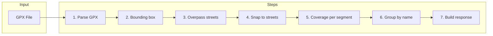
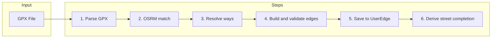

# How the Engines Work — A Plain-English Guide

This guide explains how Street Keeper figures out which streets you ran. No technical background needed. We use simple words, examples, and analogies.

---

## 1. What does Street Keeper actually do?

You go for a run. Your watch or phone records where you went using GPS. Street Keeper takes that recording and answers: **Which streets did you run on, and how much of each?**

**Analogy:** Imagine running through a city with a paintbrush — every street you touch gets painted. Street Keeper is the system that checks which streets got paint on them.

---

## 2. What is a GPX file?

A **GPX file** is the recording your watch or phone saves. It is a small text file (in a format called XML) that contains a list of points. Each point has:

- **Latitude and longitude** — where you were
- **Timestamp** — when you were there (optional but useful)

**Simple example:** A 30-minute run might produce 100 to 200 points — like dropping a breadcrumb on the map every few seconds. The GPX file is just that list of breadcrumbs.

**Why it matters:** The GPX file is the only input Street Keeper gets. Everything we do — matching you to streets, counting completion — starts from those points.

---

## 3. The core problem: GPS is messy

GPS is not perfect. Your position can be off by **5 to 15 meters** (or more near buildings, under trees, or in tunnels). That causes real problems when we try to say "you ran on High Street":

- **Parallel streets:** You might have been on the main road, but GPS says you were on the side street next to it.
- **Intersections:** At a crossroads, a few meters of error can put you on the wrong road.
- **Tall buildings and tunnels:** GPS can jump or disappear.
- **Short streets:** A 20-meter alley can be missed entirely if no point falls close enough.

**Analogy:** It is like someone describing your run by pointing at a map with a shaky hand — close, but not exact.

**Important:** Apps like **CityStrides** (and others that track "streets you have run") face the **exact same issue**. Street completion is always an approximation. We try to get it right with smart matching, but edge cases will always exist.

| Problem | How it affects street matching |
|--------|--------------------------------|
| GPS drift (5–15 m) | Your track may be assigned to the street next to the one you actually ran on. |
| Parallel roads | We might mark the wrong road as "run." |
| Intersections | A few points can flip to the other street at a junction. |
| Tunnels / no signal | Gaps in the track; we might skip a street or merge two segments. |
| Very short segments | Short alleys or connectors can be missed if no point is close enough. |

---

## 4. The external services we use (and why)

Street Keeper does not draw the map itself. We use other services to know where roads are and to "snap" your GPS points onto them.

| Service | What it is | What we use it for |
|---------|------------|--------------------|
| **OpenStreetMap (OSM)** | A free, crowd-sourced map of the world. | Our source of truth for "what streets exist" and their shape. |
| **Overpass API** | A search engine for OSM data. | We ask it: "Give me all streets inside this area" (a box around your run). |
| **Mapbox Map Matching** | A paid service that corrects GPS tracks. | It "snaps" your messy points onto the road network — like autocorrect for GPS. Used only in Engine V1 when configured. |
| **OSRM** (Open Source Routing Machine) | A free, self-hostable service. | Also snaps GPS to roads, but returns **OSM node IDs** — the exact dots that make up each street. Used in Engine V2. |

**Summary:**

- **Overpass** = "What streets are in this area?"
- **Mapbox** = "Fix my wobbly GPS line and put it on the right roads" (V1, optional).
- **OSRM** = "Turn my GPS line into a list of map nodes I passed through" (V2).

---

## 5. Key vocabulary — simple definitions

| Term | Plain English | Analogy |
|------|----------------|---------|
| **Node** | A single point on the map. Every intersection and bend in a road has a node. | Like a pin on Google Maps. |
| **Way** | A line that connects nodes — one stretch of road in the map database. A street name can be shared by several ways. | One "segment" of a road as stored in the map. |
| **Edge** | The connection between two consecutive nodes on a way. The smallest "piece" of a street we track in Engine V2. | One link in a chain; we count how many links you have run. |
| **Segment** | One matched section of a street from a single run. Used in Engine V1. | One "piece" of a street we say you ran on in this run. |
| **WayCache** | A local database that stores "which nodes belong to which ways." We fill it so we do not have to ask Overpass every time. | A local copy of the map index so we can look up streets without calling the server. |
| **UserEdge** | A record meaning "User X has run this edge at least once." Engine V2 stores these. | One checkmark: "You have run this tiny piece of street." |
| **UserStreetProgress** | A record meaning "User X has covered Z% of this street." Engine V1 uses this. | "You have run 72% of High Street." |
| **PBF file** | A compressed snapshot of OSM map data for a region (e.g. a country or state). | A downloaded "map pack" for an area so we can work offline. |
| **Map matching** | The process of snapping your GPS breadcrumbs to the nearest roads on the map. | Correcting your wobbly line so it follows the real streets. |
| **Bounding box** | A rectangle drawn around your run (with a small buffer). We only fetch streets inside this box. | The "search area" so we do not load the whole world. |

---

## 6. Engine V1 — How it works, step by step

Engine V1 is **area-first**: we find out what streets are near your run, then see which ones you touched.

### Step 1: Parse the GPX file

**What happens:** We read the XML and pull out every point: latitude, longitude, and time (if present).

**In:** GPX file (binary).  
**Out:** A list of GPS points (breadcrumbs).

**Analogy:** Opening a diary and reading the list of places you wrote down.

---

### Step 2: Draw a box around the run

**What happens:** We find the northernmost, southernmost, easternmost, and westernmost points of your run and draw a rectangle around them (with a small buffer so we do not miss streets at the edges).

**In:** List of GPS points.  
**Out:** A bounding box (four coordinates).

**Analogy:** Drawing a frame around your route on the map so we only look at streets inside the frame.

---

### Step 3: Ask Overpass for streets

**What happens:** We send the box to Overpass: "Give me all streets (roads, paths, etc.) inside this rectangle." We get back a list of streets with their names, types, and shapes.

**In:** Bounding box.  
**Out:** List of streets (ways) with geometry and names.

**Analogy:** Asking a librarian for every road that appears on the map inside that frame.

---

### Step 4: Snap GPS to streets

**What happens:** We match your GPS points to those streets. We have two modes:

- **With Mapbox (if configured):** We first send your points to Mapbox. Mapbox returns a "corrected" path on the road network. We then match that path to our list of streets from Overpass. This is more accurate (around 98% in good conditions).
- **Without Mapbox:** Each GPS point is assigned to the nearest street within about 25 meters. Less accurate (around 85%) but no paid service needed.

**In:** GPS points + list of streets.  
**Out:** For each street, which points were on it and how much of the street was covered.

**Analogy:** Laying your breadcrumb trail on top of the map and deciding which road each breadcrumb belongs to.

---

### Step 5: Calculate coverage per street segment

**What happens:** For each street (way) you touched, we work out how much of its length you covered. We use the street’s shape and project your points onto it, then compute a percentage (e.g. 90% of this way).

**In:** Matched points per street.  
**Out:** Each street segment with a "coverage" percentage and a status: full (e.g. ≥90%) or partial.

---

### Step 6: Group segments into logical streets

**What happens:** In OpenStreetMap, one street name (e.g. "High Street") is often split into many small "ways." We group those by name and add up the coverage so you see one "High Street" with one overall completion.

**In:** List of segments (each with name and coverage).  
**Out:** List of logical streets (one per name) with total length and total coverage.

**Analogy:** Merging all "High Street" pieces into a single High Street and saying "you ran 80% of it."

---

### Step 7: Build the response

**What happens:** We package everything: run stats (distance, time, point count), the list of streets you ran on (with completion), and any unnamed roads grouped by type.

**In:** Run stats + logical streets + unnamed roads.  
**Out:** The JSON response the app shows you (run summary + street list).

---

### V1 pipeline — visual summary

---

## 7. Engine V2 — How it works, step by step

Engine V2 is **path-first**: we follow your path node by node and record every small "edge" of street you crossed. Edges are then stored and reused forever.

### Step 1: Parse the GPX file

**What happens:** Same as V1 — we read the file and get a list of GPS points.

**In:** GPX file.  
**Out:** List of GPS points (breadcrumbs).

---

### Step 2: OSRM map matching

**What happens:** We send your GPS points to OSRM. OSRM snaps them to the road network and returns the **exact OSM node IDs** you passed through, in order. So we get a sequence of nodes (e.g. node 123 → 124 → 125 …) instead of raw coordinates.

**In:** GPS points.  
**Out:** A list of OSM node IDs in order, plus a smoothed path (for display). Optional: confidence score (we use it for display only; we still save edges).

**Analogy:** OSRM is like a guide who walks your route and writes down the official "checkpoint" numbers you passed.

---

### Step 3: Resolve ways

**What happens:** For each pair of consecutive nodes (e.g. 123–124), we ask: "Which street (way) does this pair belong to?" We look this up in the **WayCache** first. If we do not have it, we ask Overpass (unless we have set "skip Overpass" and rely only on a pre-loaded PBF). We get back the way ID, street name, and length for each pair.

**In:** List of OSM node IDs.  
**Out:** List of "resolved edges" — each node pair with its way, name, and length.

**Analogy:** For each step you took, looking up in the map index: "This step was on which street?"

---

### Step 4: Build and validate edges

**What happens:** We turn each resolved pair into an **edge** (with a stable ID like "nodeA-nodeB"). Then we apply simple rules and reject bad ones:

- Too short (e.g. under 5 m) — often noise.
- Wrong road type (e.g. driveway, parking aisle) — we can exclude these.
- Impossible speed — if we have timestamps and the implied speed is unrealistically high, we reject it.

**In:** Resolved edges + original node order + optional timestamps.  
**Out:** Two lists: **valid edges** (kept) and **rejected edges** (discarded), plus counts.

---

### Step 5: Save edges to the database

**What happens:** Each valid edge is saved in the **UserEdge** table: one row per user per edge. If you run the same edge again, we do not duplicate it; we might just update a "run count." So over time we have a cumulative list: "This user has run these edges at least once."

**In:** User ID + list of valid edges + run date.  
**Out:** Database updated (no direct output to the user in this step).

**Analogy:** Putting a checkmark next to every link of the chain you ran; the checklist is saved and never lost.

---

### Step 6: Derive street completion

**What happens:** For each street (way), we count how many distinct edges you have run vs. how many edges that street has in total. That gives a completion percentage per street. We can also group by street name (like V1) so "High Street" appears as one line with one percentage.

**In:** All UserEdge rows for this user.  
**Out:** List of streets with "X out of Y edges" or "Z% complete," and the same kind of street list the app can show.

---

### V2 pipeline — visual summary

---

## 8. PBF and WayCache — the offline shortcut

**What is a PBF file?**  
A **PBF** (Protocol Buffer Binary) file is a compressed download of OpenStreetMap data for a region (e.g. a country or state). It contains the same nodes, ways, and geometry we would get from Overpass, but for a whole area at once.

**Why we use it:**  
We can load that data into our **WayCache** once. Then, when Engine V2 needs to know "which way does node pair A–B belong to?", we look it up locally. We do not need to call Overpass at all. That means faster runs and the ability to work without the Overpass API (e.g. offline or in restricted environments).

**How to seed it:**  
We have a script that reads a PBF file and fills the WayCache (and related tables). After that, you can set `SKIP_OVERPASS=true` so V2 never calls Overpass.

**Analogy:** Instead of asking the librarian every time you need a book, you download the whole catalog to your laptop and search there.

---

## 9. How progress is stored (V1 vs V2)

| Aspect | V1 | V2 |
|--------|----|----|
| **What we store** | **UserStreetProgress** — one row per user per street with a **percentage** (e.g. 72% of High Street). | **UserEdge** — one row per user per **edge** (tiny piece of street). Completion is "you ran 8 of 11 edges on High Street." |
| **Updates** | Each run can change the percentage (recalculated from matched segments). | Each run adds new edges; we never "undo" an edge. Counts only go up. |
| **Determinism** | Percentage can vary slightly run to run (different matching, different segments). | Edge-based: either you ran an edge or you did not. No percentage rounding. |
| **Cumulative** | Yes, but expressed as a percentage. | Yes: the list of edges you have run is the single source of truth. |

**Why edge-based is more deterministic:**  
With V2 we only ask "did you run this exact piece (edge)?" So we get a clear yes/no. With V1 we ask "how much of this street did you cover?" and express it as a percentage, which can wobble a bit depending on how points were matched.

---

## 10. Drawbacks and trade-offs

### V1 drawbacks

| Drawback | Explanation |
|----------|-------------|
| Depends on Overpass | Every run needs a call to fetch streets in the area. Overpass can be rate-limited or slow. |
| Mapbox is optional but helps a lot | Without Mapbox, accuracy drops to around 85%. With it, around 98%, but it is a paid service. |
| Percentage-based progress | The stored percentage can change slightly between runs as matching or aggregation changes. |
| No persistence from analyze alone | The analyze endpoint returns a one-off result; lasting progress for the map comes from the activity processor (e.g. Strava sync), not from a one-off GPX upload. |

### V2 drawbacks

| Drawback | Explanation |
|----------|-------------|
| Depends on OSRM | You need an OSRM instance (usually self-hosted) for production. |
| WayCache setup | For best behavior (or offline), you need to seed the WayCache (e.g. from a PBF). |
| Edge validation can reject good data | Very short streets or connectors can be rejected by the "minimum length" or other rules. |
| Harder to debug | You think in nodes, edges, and ways; logs and data are more granular. |

### Side-by-side comparison

| | V1 | V2 |
|-|----|----|
| **Cost** | Free (Overpass) + optional Mapbox (paid). | Free if you self-host OSRM; no Mapbox. |
| **Accuracy** | ~98% with Mapbox, ~85% without. | Depends on OSRM quality; typically high when the map is good. |
| **Speed** | Can be slower (Overpass + optional Mapbox per run). | Can be faster once WayCache is warm; OSRM is usually quick. |
| **Complexity** | Simpler: area → match → percentage. | More complex: nodes → edges → persistence → derivation. |
| **Persistence** | UserStreetProgress (percentage). | UserEdge (list of edges). |
| **Offline** | Needs Overpass (and Mapbox if used). | Can run fully offline with PBF-seeded WayCache and local OSRM. |

---

## 11. The frontend — how the UI picks an engine

The app does not need to know whether the backend used V1 or V2. It just calls "analyze" and "get map streets." The backend (and a small setting) decide which engine runs.

**Setting:** The frontend can set an environment variable (e.g. `VITE_GPX_ENGINE=v1` or `v2`). When set to `v2`, the app calls the V2 analyze and map-streets endpoints and passes your user ID where needed. When set to `v1` (or unset), it uses the V1-style endpoints.

**Important:** The UI gets the same kind of response either way — run summary plus list of streets with completion. So the internal pipeline (V1 vs V2) is invisible to the user.

For technical details (which endpoints, how to pass user ID, etc.), see the **Engine Integration** doc in the frontend docs.

---

## 12. Summary

- **V1 (area-first):** "Ask the map what streets are nearby, then check which ones you touched." We get a list of streets and a percentage covered for each. Progress is stored as percentages in UserStreetProgress.
- **V2 (path-first):** "Follow your footsteps node by node and record every piece of street you crossed." We get a list of edges, save them in UserEdge, and derive street completion from that. Progress is stored as edges and is cumulative and deterministic.

**Both engines** answer the same question: *Which streets did you run, and how complete is each one?* They just get there in different ways — one by area and percentages, one by path and edges.
