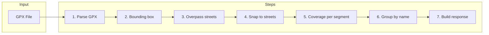
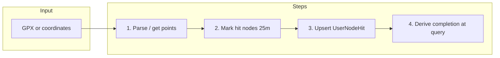

# How the Engines Work — A Plain-English Guide

This guide explains how Street Keeper figures out which streets you ran. No technical background needed. We use simple words, examples, and analogies.

---

## 1. What does Street Keeper actually do?

You go for a run. Your watch or phone records where you went using GPS. Street Keeper takes that recording and answers: **Which streets did you run on, and how much of each?**

**Analogy:** Imagine running through a city with a paintbrush — every street you touch gets painted. Street Keeper is the system that checks which streets got paint on them.

---

## 2. What is a GPX file?

A **GPX file** is the recording your watch or phone saves. It is a small text file (in a format called XML) that contains a list of points. Each point has:

- **Latitude and longitude** — where you were
- **Timestamp** — when you were there (optional but useful)

**Simple example:** A 30-minute run might produce 100 to 200 points — like dropping a breadcrumb on the map every few seconds. The GPX file is just that list of breadcrumbs.

**Why it matters:** The GPX file is the only input Street Keeper gets. Everything we do — matching you to streets, counting completion — starts from those points.

---

## 3. The core problem: GPS is messy

GPS is not perfect. Your position can be off by **5 to 15 meters** (or more near buildings, under trees, or in tunnels). That causes real problems when we try to say "you ran on High Street":

- **Parallel streets:** You might have been on the main road, but GPS says you were on the side street next to it.
- **Intersections:** At a crossroads, a few meters of error can put you on the wrong road.
- **Tall buildings and tunnels:** GPS can jump or disappear.
- **Short streets:** A 20-meter alley can be missed entirely if no point falls close enough.

**Analogy:** It is like someone describing your run by pointing at a map with a shaky hand — close, but not exact.

**Important:** Apps like **CityStrides** (and others that track "streets you have run") face the **exact same issue**. Street completion is always an approximation. We try to get it right with smart matching, but edge cases will always exist.

| Problem | How it affects street matching |
|--------|--------------------------------|
| GPS drift (5–15 m) | Your track may be assigned to the street next to the one you actually ran on. |
| Parallel roads | We might mark the wrong road as "run." |
| Intersections | A few points can flip to the other street at a junction. |
| Tunnels / no signal | Gaps in the track; we might skip a street or merge two segments. |
| Very short segments | Short alleys or connectors can be missed if no point is close enough. |

---

## 4. The external services we use (and why)

Street Keeper does not draw the map itself. We use other services to know where roads are and to "snap" your GPS points onto them.

| Service | What it is | What we use it for |
|---------|------------|--------------------|
| **OpenStreetMap (OSM)** | A free, crowd-sourced map of the world. | Our source of truth for "what streets exist" and their shape. |
| **Overpass API** | A search engine for OSM data. | We ask it: "Give me all streets inside this area" (a box around your run). |
| **Mapbox Map Matching** | A paid service that corrects GPS tracks. | It "snaps" your messy points onto the road network — like autocorrect for GPS. Used only in Engine V1 when configured. |
| **Node proximity (V2)** | CityStrides-style matching. | For each GPS point, find OSM nodes within 25 m (NodeCache); mark those nodes as "hit" in **UserNodeHit**. No external matching API. Street completion is derived at query time from node hit counts (90% rule). |

**Summary:**

- **Overpass** = "What streets are in this area?"
- **Mapbox** = "Fix my wobbly GPS line and put it on the right roads" (V1, optional).
- **Node proximity (V2)** = "Which map nodes did my GPS path get within 25 m of?" We record those as hits (UserNodeHit) and derive street completion from (nodes hit / total nodes per way) with a 90% threshold.

---

## 5. Key vocabulary — simple definitions

| Term | Plain English | Analogy |
|------|----------------|---------|
| **Node** | A single point on the map. Every intersection and bend in a road has a node. | Like a pin on Google Maps. |
| **Way** | A line that connects nodes — one stretch of road in the map database. A street name can be shared by several ways. | One "segment" of a road as stored in the map. |
| **Edge** | The connection between two consecutive nodes on a way. (Legacy V2 used edges; current V2 uses node hits.) | One link in a chain. |
| **Segment** | One matched section of a street from a single run. Used in Engine V1. | One "piece" of a street we say you ran on in this run. |
| **WayCache** | A local database that stores "which nodes belong to which ways." We fill it so we do not have to ask Overpass every time. | A local copy of the map index so we can look up streets without calling the server. |
| **UserNodeHit** | A record meaning "User X has been within 25 m of this OSM node at least once." Engine V2 stores these. | One checkmark: "You passed near this map dot." |
| **UserStreetProgress** | A record meaning "User X has covered Z% of this street." Engine V1 uses this. | "You have run 72% of High Street." |
| **PBF file** | A compressed snapshot of OSM map data for a region (e.g. a country or state). | A downloaded "map pack" for an area so we can work offline. |
| **Map matching** | The process of snapping your GPS breadcrumbs to the nearest roads on the map. | Correcting your wobbly line so it follows the real streets. |
| **Bounding box** | A rectangle drawn around your run (with a small buffer). We only fetch streets inside this box. | The "search area" so we do not load the whole world. |

---

## 6. Engine V1 — How it works, step by step

Engine V1 is **area-first**: we find out what streets are near your run, then see which ones you touched.

### Step 1: Parse the GPX file

**What happens:** We read the XML and pull out every point: latitude, longitude, and time (if present).

**In:** GPX file (binary).  
**Out:** A list of GPS points (breadcrumbs).

**Analogy:** Opening a diary and reading the list of places you wrote down.

---

### Step 2: Draw a box around the run

**What happens:** We find the northernmost, southernmost, easternmost, and westernmost points of your run and draw a rectangle around them (with a small buffer so we do not miss streets at the edges).

**In:** List of GPS points.  
**Out:** A bounding box (four coordinates).

**Analogy:** Drawing a frame around your route on the map so we only look at streets inside the frame.

---

### Step 3: Ask Overpass for streets

**What happens:** We send the box to Overpass: "Give me all streets (roads, paths, etc.) inside this rectangle." We get back a list of streets with their names, types, and shapes.

**In:** Bounding box.  
**Out:** List of streets (ways) with geometry and names.

**Analogy:** Asking a librarian for every road that appears on the map inside that frame.

---

### Step 4: Snap GPS to streets

**What happens:** We match your GPS points to those streets. We have two modes:

- **With Mapbox (if configured):** We first send your points to Mapbox. Mapbox returns a "corrected" path on the road network. We then match that path to our list of streets from Overpass. This is more accurate (around 98% in good conditions).
- **Without Mapbox:** Each GPS point is assigned to the nearest street within about 25 meters. Less accurate (around 85%) but no paid service needed.

**In:** GPS points + list of streets.  
**Out:** For each street, which points were on it and how much of the street was covered.

**Analogy:** Laying your breadcrumb trail on top of the map and deciding which road each breadcrumb belongs to.

---

### Step 5: Calculate coverage per street segment

**What happens:** For each street (way) you touched, we work out how much of its length you covered. We use the street’s shape and project your points onto it, then compute a percentage (e.g. 90% of this way).

**In:** Matched points per street.  
**Out:** Each street segment with a "coverage" percentage and a status: full (e.g. ≥90%) or partial.

---

### Step 6: Group segments into logical streets

**What happens:** In OpenStreetMap, one street name (e.g. "High Street") is often split into many small "ways." We group those by name and add up the coverage so you see one "High Street" with one overall completion.

**In:** List of segments (each with name and coverage).  
**Out:** List of logical streets (one per name) with total length and total coverage.

**Analogy:** Merging all "High Street" pieces into a single High Street and saying "you ran 80% of it."

---

### Step 7: Build the response

**What happens:** We package everything: run stats (distance, time, point count), the list of streets you ran on (with completion), and any unnamed roads grouped by type.

**In:** Run stats + logical streets + unnamed roads.  
**Out:** The JSON response the app shows you (run summary + street list).

---

### V1 pipeline — visual summary

---

## 7. Engine V2 — How it works, step by step (CityStrides-style node proximity)

Engine V2 is **node-based**: for each GPS point we ask "which OSM nodes are within 25 metres?" and mark those nodes as "hit." Street completion is **derived** at query time: for each way, (nodes hit / total nodes) with a 90% threshold (100% for streets with ≤10 nodes).

### Step 1: Parse the GPX or get coordinates

**What happens:** Same as V1 — we read the GPX (or use `Activity.coordinates` from Strava) and get a list of GPS points (lat, lng).

**In:** GPX file or JSON coordinates.  
**Out:** List of GPS points (breadcrumbs).

---

### Step 2: Mark hit nodes (25-metre proximity)

**What happens:** For **each GPS point** we do not call any external API. We:

1. Build a small **bounding box** around the point (e.g. 25 m in each direction).
2. Query **NodeCache** for all nodes whose (lat, lon) fall inside that box.
3. For each candidate node, compute the **haversine distance** from the GPS point to the node.
4. If the distance is **≤ 25 metres**, we record that node as "hit" for this user.

We then **upsert** into **UserNodeHit**: one row per (userId, nodeId). If the user already hit that node, we do not duplicate; the unique constraint keeps one row per user per node.

**In:** User ID + list of GPS points.  
**Out:** Database updated with new UserNodeHit rows; we return how many nodes were hit in this run.

**Analogy:** Imagine drawing a 25-metre circle around every breadcrumb of your run. Every map "dot" (node) that falls inside any of those circles gets a checkmark. We save those checkmarks. No phone call to a server — we use our local copy of the map (NodeCache).

**Why 25 metres?** It is a "Goldilocks" distance: big enough to allow for GPS drift and running on the pavement instead of the centre of the road, but small enough that running down a parallel alley usually does not trigger nodes on the main street.

---

### Step 3: Derive street completion (at query time)

**What happens:** We do **not** store completion per street in a table. Whenever we need "how complete is this street for this user?" we:

1. Look up all **nodeIds** for that way in **WayNode**.
2. Look up **totalNodes** for that way in **WayTotalEdges**.
3. Count how many of those nodeIds appear in **UserNodeHit** for this user (= nodes hit).
4. Compute: **nodesHit / totalNodes**. If the street has **≤ 10 nodes**, we require **100%** (you must hit every node). If it has **> 10 nodes**, we require **≥ 90%** to consider the street "complete."

**In:** User ID + list of ways (e.g. from a project snapshot or map bounds).  
**Out:** For each way: percentage and whether it is complete (boolean).

**Worked example:** User runs a 3 km route. The GPX has 180 points. The run passes through 4 streets. Street A has 15 nodes; 14 are within 25 m of the GPS path → 14/15 ≈ 93% → **complete**. Street B has 8 nodes; 7 are hit → 7/8 = 87.5%, but since 8 ≤ 10 we require 100% → **incomplete**.

---

### V2 pipeline — visual summary

---

## 8. PBF and local caches — the offline shortcut

**What is a PBF file?**  
A **PBF** (Protocol Buffer Binary) file is a compressed download of OpenStreetMap data for a region (e.g. a country or state). It contains the same nodes, ways, and geometry we would get from Overpass, but for a whole area at once.

**Why we use it:**  
We run a seed script that loads the PBF into **NodeCache** (node coordinates), **WayCache** (node→way mapping), **WayNode** (way→node list), and **WayTotalEdges** (total nodes per way). Then Engine V2 can answer "which nodes are near this GPS point?" and "how many nodes does this street have?" entirely from the database. No Overpass (or any external API) is needed for matching.

**How to seed it:**  
Run the script (e.g. `npm run seed:way-cache -- path/to/region.pbf`). It fills NodeCache, WayCache, WayNode, and WayTotalEdges. You can use flags like `--node-cache-only` or `--way-nodes-only` to run in stages. After seeding, set `SKIP_OVERPASS=true` so V2 does not call Overpass.

**Analogy:** Instead of asking the librarian every time you need a book, you download the whole catalog to your laptop and search there.

---

## 9. How progress is stored (V1 vs V2)

| Aspect | V1 | V2 |
|--------|----|----|
| **What we store** | **UserStreetProgress** — one row per user per street with a **percentage** (e.g. 72% of High Street). | **UserNodeHit** — one row per user per **node** that was within 25 m of a GPS point. Completion is **derived**: (nodes hit / total nodes) per way, with 90% rule. |
| **Updates** | Each run can change the percentage (recalculated from matched segments). | Each run adds new node hits; we never remove a hit. Cumulative. |
| **Determinism** | Percentage can vary slightly run to run (different matching, different segments). | Node-based: either you were within 25 m of a node or you were not. Completion is derived at query time. |
| **Cumulative** | Yes, but expressed as a percentage. | Yes: the list of nodes you have "hit" is the source of truth; street completion is computed from it. |

**Why node-based is simple and robust:**  
We only ask "was this GPS point within 25 m of this map node?" So we get a clear yes/no per node. Street completion is then (nodes hit / total nodes) with a fixed rule (90% or 100% for short streets). No HMM or edge coverage filter — just distance and counting.

---

## 10. Drawbacks and trade-offs

### V1 drawbacks

| Drawback | Explanation |
|----------|-------------|
| Depends on Overpass | Every run needs a call to fetch streets in the area. Overpass can be rate-limited or slow. |
| Mapbox is optional but helps a lot | Without Mapbox, accuracy drops to around 85%. With it, around 98%, but it is a paid service. |
| Percentage-based progress | The stored percentage can change slightly between runs as matching or aggregation changes. |
| No persistence from analyze alone | The analyze endpoint returns a one-off result; lasting progress for the map comes from the activity processor (e.g. Strava sync), not from a one-off GPX upload. |

### V2 drawbacks

| Drawback | Explanation |
|----------|-------------|
| PBF seed required | You need to run the seed script (NodeCache, WayNode, WayTotalEdges, WayCache) for the region you care about. Can be slow and memory-heavy for large areas. |
| One query per GPS point | For each point we query NodeCache (e.g. by bbox); many points mean many queries. Batched/optimized in practice. |
| 90% rule edge cases | Short streets (≤10 nodes) require 100%; one missed node (e.g. bad GPS at a corner) leaves the street incomplete. |
| Harder to debug | You think in nodes and ways; completion is derived at query time, not stored per street. |

### Side-by-side comparison

| | V1 | V2 |
|-|----|----|
| **Cost** | Free (Overpass) + optional Mapbox (paid). | Free: node proximity + PBF seed; no external matching API. |
| **Accuracy** | ~98% with Mapbox, ~85% without. | CityStrides-style: 25 m snap + 90% node rule; stable and comparable to CityStrides. |
| **Speed** | Can be slower (Overpass + optional Mapbox per run). | No external matching call; depends on DB (NodeCache lookups per point). |
| **Complexity** | Simpler: area → match → percentage. | Simple pipeline: points → mark nodes within 25 m → UserNodeHit; completion derived at query time. |
| **Persistence** | UserStreetProgress (percentage). | UserNodeHit (node hits); completion derived from UserNodeHit + WayNode + WayTotalEdges. |
| **Offline** | Needs Overpass (and Mapbox if used). | Can run fully offline after PBF seed (NodeCache, WayNode, WayTotalEdges, WayCache). |

---

## 11. The frontend — how the UI picks an engine

The app does not need to know whether the backend used V1 or V2. It just calls "analyze" and "get map streets." The backend (and a small setting) decide which engine runs.

**Setting:** The frontend can set an environment variable (e.g. `VITE_GPX_ENGINE=v1` or `v2`). When set to `v2`, the app calls the V2 analyze and map-streets endpoints and passes your user ID where needed. When set to `v1` (or unset), it uses the V1-style endpoints.

**Important:** The UI gets the same kind of response either way — run summary plus list of streets with completion. So the internal pipeline (V1 vs V2) is invisible to the user.

For technical details (which endpoints, how to pass user ID, etc.), see the **Engine Integration** doc in the frontend docs.

---

## 12. Summary

- **V1 (area-first):** "Ask the map what streets are nearby, then check which ones you touched." We get a list of streets and a percentage covered for each. Progress is stored as percentages in UserStreetProgress.
- **V2 (node proximity):** "For each GPS point, which map nodes are within 25 m? Mark those as hit." We save node hits in UserNodeHit and derive street completion at query time: (nodes hit / total nodes) per way, with a 90% threshold (100% for streets with ≤10 nodes). Progress is stored as node hits and is cumulative.

**Both engines** answer the same question: *Which streets did you run, and how complete is each one?* They just get there in different ways — one by area and percentages, one by node proximity and a fixed completion rule.
