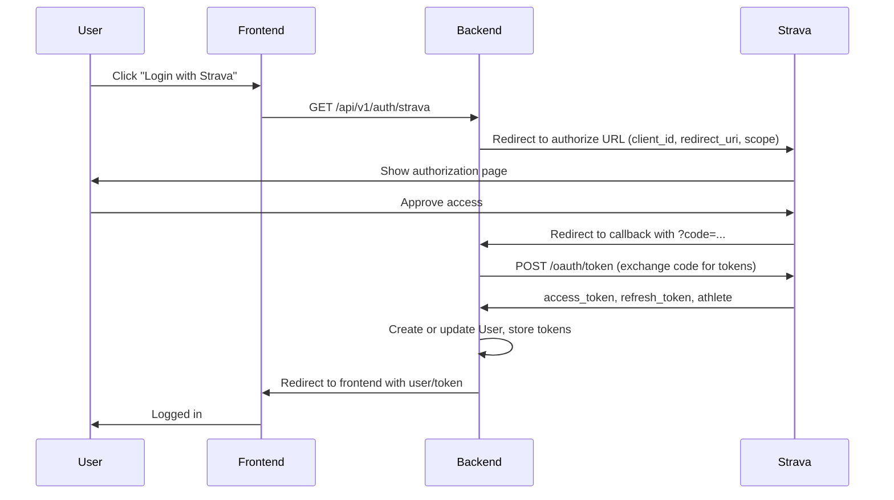

# Strava Integration

Street Keeper uses the **Strava API** for login (OAuth) and for activity data (GPS, metadata). This document covers the OAuth flow, token refresh, what data we fetch, webhooks, and rate limits.

---

## OAuth flow

Users log in with Strava. The backend never stores passwords; it stores **access** and **refresh** tokens after the user authorizes.

- **Redirect URI** must be the **frontend** URL that receives the callback (e.g. `http://localhost:5173/auth/callback`). The backend’s callback endpoint receives the `code` and exchanges it for tokens server-side, then redirects to the frontend with the session or token.
- **Scopes:** We request `read` and `activity:read_all` so we can read the user’s profile and all activities (including private).

---

## Token refresh

Strava access tokens expire (typically 6 hours). Before any Strava API call that uses the stored access token, the backend checks **stravaTokenExpiresAt**. If the token is expired (or within a short buffer, e.g. 5 minutes), it calls **refreshAccessToken(refreshToken)** to get a new access token, then updates the user row and proceeds. This is implemented in the Strava service; callers use the same “get valid token” helper so refresh is transparent.

---

## Data we fetch from Strava

- **OAuth:** Athlete profile (id, name, profile picture) and tokens.
- **Activities:** List of activities (GET /athlete/activities) and, for each activity we process, the **streams** (GET /activities/:id/streams) for **latlng** (and optionally time, distance). We store activity metadata (name, distance, duration, startDate, type) and the **coordinates** JSON (array of { lat, lng }) in our **Activity** table so we don’t re-fetch for reprocessing.
- **Webhooks:** We don’t fetch full activity in the webhook handler; we only validate the payload and enqueue a job. The worker then fetches the activity and streams as above.

---

## Webhook lifecycle

1. **Subscription:** You create a subscription to Strava’s webhook (POST to Strava’s API with your callback URL and verify token). The backend can support a script or admin flow for this; the **verify token** is read from `STRAVA_WEBHOOK_VERIFY_TOKEN` (or a default).
2. **Verification:** When you subscribe, Strava sends GET requests to your callback URL with `hub.mode=subscribe`, `hub.challenge`, `hub.verify_token`. The backend must respond with `{ "hub.challenge": "<hub.challenge>" }` so Strava confirms the endpoint.
3. **Events:** Strava sends POST requests for `activity.create` and `activity.update`. The backend must respond with **200 within 2 seconds**. We do minimal validation, enqueue a job (e.g. pg-boss) with the activity ID and user/owner info, and return 200. The worker then fetches the activity and processes it (see [BACKGROUND_JOBS](/docs/background-jobs)).
4. **Base URL:** The webhook callback URL must be publicly reachable. `BASE_URL` (or similar) is used when registering the webhook; the actual route is e.g. `POST /api/v1/webhooks/strava`.

---

## Rate limits

Strava enforces **100 requests per 15 minutes** and **1000 per day** (per app). The backend avoids unnecessary calls by storing activity coordinates and reusing them for processing. Token refresh and activity/stream fetches are the main consumers. If you hit limits, Strava returns 429; the backend should back off and retry (e.g. in the worker) rather than failing permanently.
